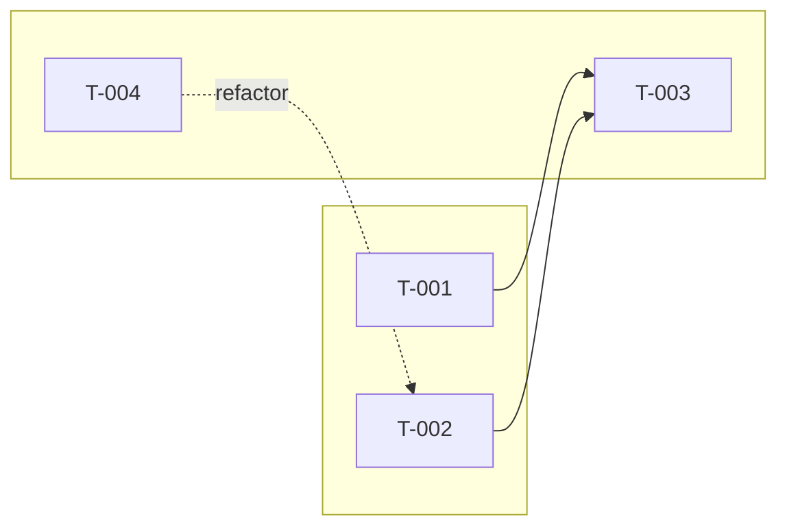

# /al-scope, architecture.md to task list

Decompose `architecture.md` into per-task entries in `tasks.md`. Output is `## Goal` (architecture.md `## Solution` verbatim) plus an optional Mermaid dependency graph, a `## Summary` index table, and `## Tasks` containing one `<details>` block per `T-NNN`. Each task carries declared dependency edges, an initial description paragraph, and an empty `**Tests**` block for `/al-refine` to fill. No Gherkin (that is `/al-refine`), no per-task seam (that is `/al-implement`).

## Resolve target paths

- **Branch** must match `^\d{3}-`. If not, `Stop.` Run `/al-design`.
- **Spec folder** `specs/<branch>/` must already contain `architecture.md`. If missing, `Stop.` Run `/al-design`.
- **Output** `specs/<branch>/tasks.md`, created or overwritten.

Read before writing to `tasks.md`:

- `${CLAUDE_SKILL_DIR}/../../references/voice-contract.md`, voice rules, em-dash ban, one-line vs prose cadence map.
- `${CLAUDE_SKILL_DIR}/../../references/notes-discipline.md`, per-task structure, NOTE/IMPORTANT/WARNING alert rules, valid Notes-line shapes.

## Process

### 1. Read the architecture

Take `## Solution` (becomes `## Goal` verbatim), the `## Slice(s) (Event Modeling)` paragraph(s), the module map, the R → P → W boundary, brownfield touchpoints, and test strategy as inputs. Do not re-derive any of these. The slice paragraph(s) name the initiated behaviour the feature delivers; the *wire* task in the decomposed list is the one crossing the slice's trigger; everything else composes into it.

### 2. Derive task entries

One imperative title plus one description paragraph per task. Each task maps to a coherent slice of behaviour, typically a single scenario family from the test strategy. Use BC field, codeunit, and table names as compression.

**Vertical slicing.** Every `T-NNN` ships tests plus production code together. *Layer-only tasks* (data-only without callers, logic-only without tests, wire-up-only without their target) are an anti-pattern. If a task cannot satisfy this, split or merge until it does. The *kind* of slice varies (primitive: pure logic plus tests; extract: refactor moving an existing capability; wire: the slice's trigger surface; fix: contract correction; pure refactor: shape change under invariant); verticality does not. The opposite, *horizontal phasing* (data first, then logic, then UI, then tests-as-afterthought), is rejected by name.

A complex `## Slice(s)` paragraph in `architecture.md` typically fans into many tasks: one *wire* task crossing the slice's trigger, plus *primitive / extract / fix* tasks composing into it. One slice does not equal one task. The slice is the architectural unit; the task is the TDD-cycle unit.

### 3. Order ZOMBIES

Zero, One, Many, Boundary, Interfaces, Exception, Simple. Start with the simplest case that exercises the seam, then layer complexity outward.

### 4. Declare edges

For each task, identify cross-task relationships and write them as structured lines above the description paragraph. Three line shapes map to three Mermaid edge shapes:

| Line shape | Meaning | Renders as |
|---|---|---|
| `**Depends on:** T-NNN, T-NNN` | This task cannot land without those tasks already in place | solid `-->` |
| `**Refactors:** T-NNN` | This task reshapes code shipped by that task under an invariant | dashed `-.->` labelled `refactor` |
| `**Fixes:** T-NNN` | This task corrects a defect or wrong contract from that task | dashed `-.->` labelled `fixes` |

Omit a line shape entirely when the task has no edges of that kind. Source the edges from the architecture's slice / module map / brownfield touchpoints: a task that wires a slice trigger depends on the primitive tasks it composes; a refactor task points at the task whose object it reshapes.

### 5. Group into subgraph phases

Pick 2 to 4 phase labels in domain vocabulary that group the tasks, derived from the architecture's slices and module map. Examples: `Primitives / Integration / Refactors`, `Captions & Promotion / Quality gates / Service extraction`. Every task belongs to exactly one phase. Phases are hand-curated at scope time; `/al-steer` may later add new phases on replan.

For trivial features (≤2 tasks, or all tasks in a single linear chain with no `**Refactors:**` or `**Fixes:**` edges) the graph adds no signal; skip it. Otherwise render.

### 6. Replan check (gate)

If decomposition surfaces a gap `architecture.md` does not cover (missing module, pattern conflict, unnamed brownfield touchpoint), do not invent. `Stop.` Run `/al-steer`. The replan venue routes to `/al-grill-adr` or an `/al-design` re-run.

### 7. Write tasks.md

Use the output shape below. `Stop.` `/al-refine` consumes the list one task at a time next.

## Output: tasks.md

```markdown
## Goal

<architecture.md ## Solution paragraph verbatim>



## Summary

| Task | Title | Tests | Layer | Mutations |
|------|-------|------:|-------|-----------|
| [T-001](#t-001) | <title> | - | - | - |
| [T-002](#t-002) | <title> | - | - | - |

## Tasks

<a id="t-001"></a>
<details>
<summary><strong>[ ] T-001: <Imperative title></strong></summary>

> [!NOTE]
> **Absorbed**: <one phrase, scaffolding bundled with this task>

**Depends on:** T-NNN, T-NNN
**Refactors:** T-NNN
**Fixes:** T-NNN

<Description paragraph: one to three sentences. BC site plus invariant the task preserves. Cite ADRs inline as [ADR-NNNN](../../docs/adr/NNNN-slug.md). Normal prose voice, no em-dashes.>

**Tests**

<empty until /al-refine fills the Pure and E2E sub-blocks>

</details>
```

**Adaptive column rules** for the Summary table:

- The `Tests` column is right-aligned. Value is `-` at scope time; `/al-refine` updates it to the scenario count.
- The `Layer` column is dropped from the table header when no task in the spec carries a Layer override or explicit family layer override at scope time.
- The `Mutations` column starts as `-` for every task; `/al-mutate` updates each row when it writes the result chip.
- If a column would be `-` for every row at the moment of write, drop it. The table is regenerated on every write; the column re-appears when any row earns a value.

**Adaptive alert rules** per task block:

- The NOTE alert is present iff the task has any of: `**Absorbed**` scaffolding identified at scope time, a `**Layer**` value (explicit or override), or a `**Mutations**` chip (filled by `/al-mutate`). Omit entirely if the task has none.
- The IMPORTANT alert is added later by `/al-refine`, `/al-implement`, `/al-refactor`, or `/al-steer` when a replan trigger fires. Not written at scope time.
- The WARNING alert is added when a critical hidden risk surfaces in the task body (rare). Not written at scope time unless the architecture's Risks section calls one out against this specific task.

**Mermaid graph gating:**

- Render when ≥3 tasks AND ≥1 task carries `**Refactors:**` or `**Fixes:**`, OR the dependency edges form a non-linear shape (fan-out, fan-in, multi-source).
- Skip when ≤2 tasks, or all tasks form a single linear chain with only `**Depends on:**` edges (the Summary table is enough; the graph would just restate the ZOMBIES order).

## Description paragraph cadence

One to three sentences. Normal prose voice. BC site first, then the invariant the task preserves or the contract it ships. Cite ADRs inline as `[ADR-NNNN](../../docs/adr/NNNN-slug.md)`. No em-dashes (substitute by job; see `voice-contract.md`).

**Yes/No.**

- No: *"Codeunit 80 Sales-Post.OnAfterPostSalesDoc subscriber should be added; needs to handle returns and credit memos, and update the new 'External Doc Status' field on Sales Header."*
- Yes: *"`NALICFCopyDocSubscribers.OnAfterPostSalesDoc` subscribes to `Codeunit 80 Sales-Post.OnAfterPostSalesDoc` to set `Sales Header.\"External Doc Status\"` per [ADR-0005](../../docs/adr/0005-external-doc-status-tracking.md). Subscriber fires on Invoice, Credit Memo, and Order document types; existing `Sales-Post` flow is untouched."*

`/al-refine` may rewrite the description after walking the codebase, swapping in concrete `file:line` citations, object IDs from `/al-research`, or sharpened invariants the codebase walk surfaces.

## Notes

- **Status markers**: `[ ]` ready, `[~]` in progress, `[x]` done, `[!]` blocked. Scope writes only `[ ]`.
- **Task IDs**: `T-NNN` monotonic, never reused. Start at `T-001`. The anchor `<a id="t-NNN">` uses the lowercase form (`t-001`) matching the Summary link.
- **Scaffolding rides with its object.** Permission set entries, object ID assignment, captions, translations bundle into the task that introduces the new codeunit, table, or page they cover. Never their own task. When scope time identifies bundled scaffolding, write a `**Absorbed**` chip in the NOTE alert.
- **No `**Mutations**`, `**Replan**`, or `**Layer**` Notes lines.** Those metadata items live in the NOTE / IMPORTANT alerts; see `notes-discipline.md`.
- **`**Notes**` block is for non-obvious BC constraints and deferred decisions only.** Empty at scope time for most tasks.

## Composition

`/al-design` is the precondition; `architecture.md` must exist. `/al-research` for non-trivial BC areas before drafting. `/bc-standard-reference` when grounding scope in BaseApp behaviour. `/al-refine` consumes one task at a time next. `/al-steer` owns replan when the gate trips.

## Out of scope

- No grilling. `/al-grill-adr` ran already.
- No branch or spec-folder creation. `/al-design` did that.
- No Gherkin. `/al-refine`.
- No code edits, no per-task seam decisions. `/al-implement` step 2.
- No replan mutations. `/al-steer`.
