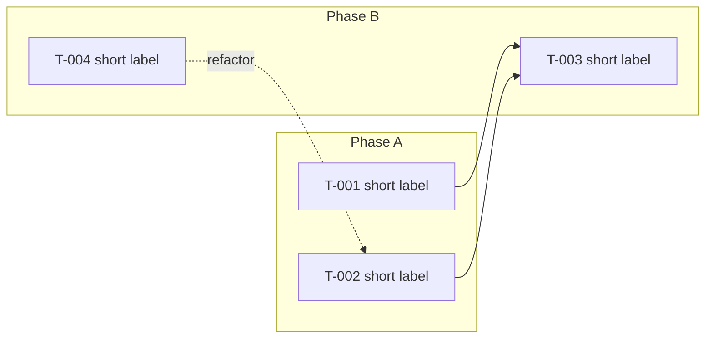

# /al-scope, architecture.html to task list

Decompose `architecture.html` into per-task entries in `tasks.html`. Output is the Goal (architecture.html `Solution` verbatim) plus an optional Mermaid dependency graph, a Summary index table, and one collapsible task block per `T-NNN`. Each task carries declared dependency edges, an initial description paragraph, and an empty Tests slot for `/al-refine` to fill. No Gherkin (that is `/al-refine`), no per-task seam (that is `/al-implement`).

## Resolve target paths

- **Branch** must match `^\d{3}-`. If not, `Stop.` Run `/al-design`.
- **Spec folder** `specs/<branch>/` must already contain `architecture.html`. If missing, `Stop.` Run `/al-design`.
- **Legacy markdown spec**, folder contains `architecture.md` but not `architecture.html`. `Stop.` Legacy specs are frozen; surface the choice (delete the markdown and reshape into HTML via `/al-design`, or hand-migrate).
- **Output** `specs/<branch>/tasks.html`, created or overwritten.

Read before writing to `tasks.html`:

- `${CLAUDE_SKILL_DIR}/../../references/voice-contract.md`, voice rules, em-dash ban, one-line vs prose cadence map.
- `${CLAUDE_SKILL_DIR}/../../references/notes-discipline.md`, NOTE / IMPORTANT / WARNING alert rules, valid Notes-line shapes, Summary regeneration rule.
- `${CLAUDE_SKILL_DIR}/../../references/html-spec-discipline.md`, aesthetic posture, data-attribute contract, Mermaid embedding, self-contained constraint, prior-spec consultation.
- The most recently modified prior spec under `specs/*/`, if any, for visual coherence within this project.

## Process

### 1. Read architecture.html

Take the Solution slot (becomes the Goal verbatim), the Slice(s) (Event Modeling) paragraph(s), the Module map, the R → P → W boundary, brownfield touchpoints, and test strategy as inputs. Do not re-derive any of these. The slice paragraph(s) name the initiated behaviour the feature delivers; the *wire* task in the decomposed list is the one crossing the slice's trigger; everything else composes into it.

### 2. Derive task entries

One imperative title plus one description paragraph per task. Each task maps to a coherent slice of behaviour, typically a single scenario family from the test strategy. Use BC field, codeunit, and table names as compression.

**Vertical slicing.** Every `T-NNN` ships tests plus production code together. *Layer-only tasks* (data-only without callers, logic-only without tests, wire-up-only without their target) are an anti-pattern. If a task cannot satisfy this, split or merge until it does. The *kind* of slice varies (primitive: pure logic plus tests; extract: refactor moving an existing capability; wire: the slice's trigger surface; fix: contract correction; pure refactor: shape change under invariant); verticality does not. The opposite, *horizontal phasing* (data first, then logic, then UI, then tests-as-afterthought), is rejected by name.

A complex Slice(s) paragraph in `architecture.html` typically fans into many tasks: one *wire* task crossing the slice's trigger, plus *primitive / extract / fix* tasks composing into it. One slice does not equal one task. The slice is the architectural unit; the task is the TDD-cycle unit.

### 3. Order ZOMBIES

Zero, One, Many, Boundary, Interfaces, Exception, Simple. Start with the simplest case that exercises the seam, then layer complexity outward.

### 4. Declare edges

For each task, identify cross-task relationships. Three edge kinds map to three Mermaid edge shapes:

| Edge | Meaning | Renders as |
|---|---|---|
| `Depends on:` T-NNN, T-NNN | This task cannot land without those tasks already in place | solid `-->` |
| `Refactors:` T-NNN | This task reshapes code shipped by that task under an invariant | dashed `-.->` labelled `refactor` |
| `Fixes:` T-NNN | This task corrects a defect or wrong contract from that task | dashed `-.->` labelled `fixes` |

Omit an edge kind entirely when the task has no edges of that kind. Source the edges from the architecture's slice / module map / brownfield touchpoints: a task that wires a slice trigger depends on the primitive tasks it composes; a refactor task points at the task whose object it reshapes.

Render edges inside the task body as a structured block (the aesthetic decides the visible form: labelled lines, a hanging-indent list, an inline run). Maintaining skills find edges by reading prose, not by data attribute; the contract on edges is content, not structure.

### 5. Group into subgraph phases

Pick 2 to 4 phase labels in domain vocabulary that group the tasks, derived from the architecture's slices and module map. Examples: `Primitives / Integration / Refactors`, `Captions & Promotion / Quality gates / Service extraction`. Every task belongs to exactly one phase. Phases are hand-curated at scope time; `/al-steer` may later add new phases on replan.

For trivial features (≤2 tasks, or all tasks in a single linear chain with no `Refactors:` or `Fixes:` edges) the graph adds no signal; skip it. Otherwise render.

### 6. Replan check (gate)

If decomposition surfaces a gap `architecture.html` does not cover (missing module, pattern conflict, unnamed brownfield touchpoint), do not invent. `Stop.` Run `/al-steer`. The replan venue routes to `/al-grill-adr` or an `/al-design` re-run.

### 7. Write tasks.html

Self-contained HTML, one document. Inline `<style>`, Google Fonts via CDN, Mermaid pinned `@11` via jsdelivr. The data-attribute contract from `html-spec-discipline.md` is mandatory; aesthetic markup around the hooks is free.

`Stop.` `/al-refine` consumes the list one task at a time next.

## Output: tasks.html

Three slots, in order: Goal, optional task-dependency Mermaid graph, Summary table, Tasks.

### Goal

Architecture.html Solution paragraph verbatim. One paragraph, no padding.

### Task dependency graph (gated)

Embed as `<div class="mermaid" data-graph="task-deps">`. Mermaid `graph LR` with subgraph blocks per phase. Each subgraph holds one node per task: `T001[T-001 short label]`.



**Graph gating:**

- Render when ≥3 tasks AND ≥1 task carries `Refactors:` or `Fixes:`, OR the dependency edges form a non-linear shape (fan-out, fan-in, multi-source).
- Skip when ≤2 tasks, or all tasks form a single linear chain with only `Depends on:` edges (the Summary table is enough; the graph would just restate the ZOMBIES order).

### Summary

HTML table, one row per task. Each row carries `<tr data-summary-row="T-NNN">` so `/al-mutate` and `/al-refine` can surgically update cells.

Columns at scope time: `Task`, `Title`, `Tests`, `Layer`, `Mutations`.

- `Task`: anchor link to the per-task block (e.g., `<a href="#t-001">T-001</a>`).
- `Title`: the task title (one phrase).
- `Tests`: count of scenarios; right-aligned. `-` at scope time; `/al-refine` updates.
- `Layer`: layer chip value (`Pure` / `E2E` / `Both` / override expression). `-` at scope time unless a task carries an explicit Layer at scope time.
- `Mutations`: mutation chip value. `-` at scope time; `/al-mutate` updates.

**Adaptive columns:** If a column would carry the placeholder (`-`) for every row in the current state, omit the column from the rendered table. When the next write makes a column relevant, re-add it. Status does NOT appear in the Summary; it lives only on `data-status` of the task `<details>`.

### Tasks

One per-task block per T-NNN, in ID order. Each block:

```html
<details data-task="T-001" data-status="ready">
  <summary><strong>T-001: <Imperative title></strong></summary>

  <aside data-alert="note">
    <strong>Absorbed:</strong> one phrase, scaffolding bundled with this task
  </aside>

  <p><strong>Depends on:</strong> T-NNN, T-NNN</p>
  <p><strong>Refactors:</strong> T-NNN</p>
  <p><strong>Fixes:</strong> T-NNN</p>

  <p><Description paragraph: one to three sentences. BC site plus invariant the task preserves. Cite ADRs as <a href="../../docs/adr/NNNN-slug.md">ADR-NNNN</a>. Normal prose voice, no em-dashes.></p>

  <section data-section="tests">
    <!-- empty until /al-refine fills the Pure and E2E sub-blocks -->
  </section>
</details>
```

The structure above shows the **slot identities and order**, not a fixed render. Aesthetic chooses: how the `<summary>` is styled (display weight, glyph rendering of the status from `data-status`), whether alerts render as floated marginalia or in-flow framed paragraphs, how edges are visually grouped, how the empty Tests slot is signposted. The `data-task`, `data-status`, `data-alert`, `data-section="tests"` attributes are the contract; the markup around them is free.

**Status glyph rendering.** The visible status marker (`[ ]`, `[~]`, `[x]`, `[!]`) is rendered from `data-status` via CSS pseudo-element keyed off the attribute, or via a duplicated `<span>` inside `<summary>`. Whichever the aesthetic chooses. Maintaining skills flip only the `data-status` attribute, never the visible glyph.

**Adaptive alert rules** per task block:

- The NOTE alert is present iff the task has any of: an `Absorbed` scaffolding chip identified at scope time, a `Layer` value (explicit or override), or a `Mutations` chip (filled by `/al-mutate`). Omit entirely if the task has none.
- The IMPORTANT alert is added later by `/al-refine`, `/al-implement`, `/al-refactor`, or `/al-steer` when a replan trigger fires. Not written at scope time.
- The WARNING alert is added when a critical hidden risk surfaces in the task body (rare). Not written at scope time unless the architecture's Risks section calls one out against this specific task.

## Description paragraph cadence

One to three sentences. Normal prose voice. BC site first, then the invariant the task preserves or the contract it ships. Cite ADRs inline as `<a href="../../docs/adr/NNNN-slug.md">ADR-NNNN</a>`. No em-dashes (substitute by job; see `voice-contract.md`).

**Yes/No.**

- _Avoid_: *"Codeunit 80 Sales-Post.OnAfterPostSalesDoc subscriber should be added; needs to handle returns and credit memos, and update the new 'External Doc Status' field on Sales Header."*
- Use: *"`NALICFCopyDocSubscribers.OnAfterPostSalesDoc` subscribes to `Codeunit 80 Sales-Post.OnAfterPostSalesDoc` to set `Sales Header.\"External Doc Status\"` per `<a href=\"../../docs/adr/0005-external-doc-status-tracking.md\">ADR-0005</a>`. Subscriber fires on Invoice, Credit Memo, and Order document types; existing `Sales-Post` flow is untouched."*

`/al-refine` may rewrite the description after walking the codebase, swapping in concrete `file:line` citations, object IDs from `/al-research`, or sharpened invariants the codebase walk surfaces.

## Notes

- **Status values**: `ready` / `in-progress` / `done` / `blocked` (on `data-status`). Scope writes only `ready`.
- **Task IDs**: `T-NNN` monotonic, never reused. Start at `T-001`. The `data-task` attribute and the anchor `id` use the same form (`data-task="T-001"` and `id="t-001"` for cross-doc links).
- **Scaffolding rides with its object.** Permission set entries, object ID assignment, captions, translations bundle into the task that introduces the new codeunit, table, or page they cover. Never their own task. When scope time identifies bundled scaffolding, write an `Absorbed` chip inside a NOTE alert.
- **No Mutations, Replan, or Layer Notes lines.** Those metadata items live in the NOTE / IMPORTANT alerts; see `notes-discipline.md`.
- **Notes lines are for non-obvious BC constraints and deferred decisions only.** Empty at scope time for most tasks.

## Composition

`/al-design` is the precondition; `architecture.html` must exist. `/al-research` for non-trivial BC areas before drafting. `/bc-standard-reference` when grounding scope in BaseApp behaviour. `/al-refine` consumes one task at a time next. `/al-steer` owns replan when the gate trips.

**References** (`${CLAUDE_SKILL_DIR}/../../references/`):

- `html-spec-discipline.md`, aesthetic posture, data-attribute contract, Mermaid embedding, self-contained constraint, prior-spec consultation; mandatory before writing `tasks.html`.
- `voice-contract.md`, voice rules for prose.
- `notes-discipline.md`, destination map for chips, alerts, Notes lines; Summary regeneration rule.

## Out of scope

- No grilling. `/al-grill-adr` ran already.
- No branch or spec-folder creation. `/al-design` did that.
- No Gherkin. `/al-refine`.
- No code edits, no per-task seam decisions. `/al-implement` step 2.
- No replan mutations. `/al-steer`.
- No markdown-mode output. Legacy markdown specs are frozen; `/al-scope` refuses to run on a folder that lacks `architecture.html`.
