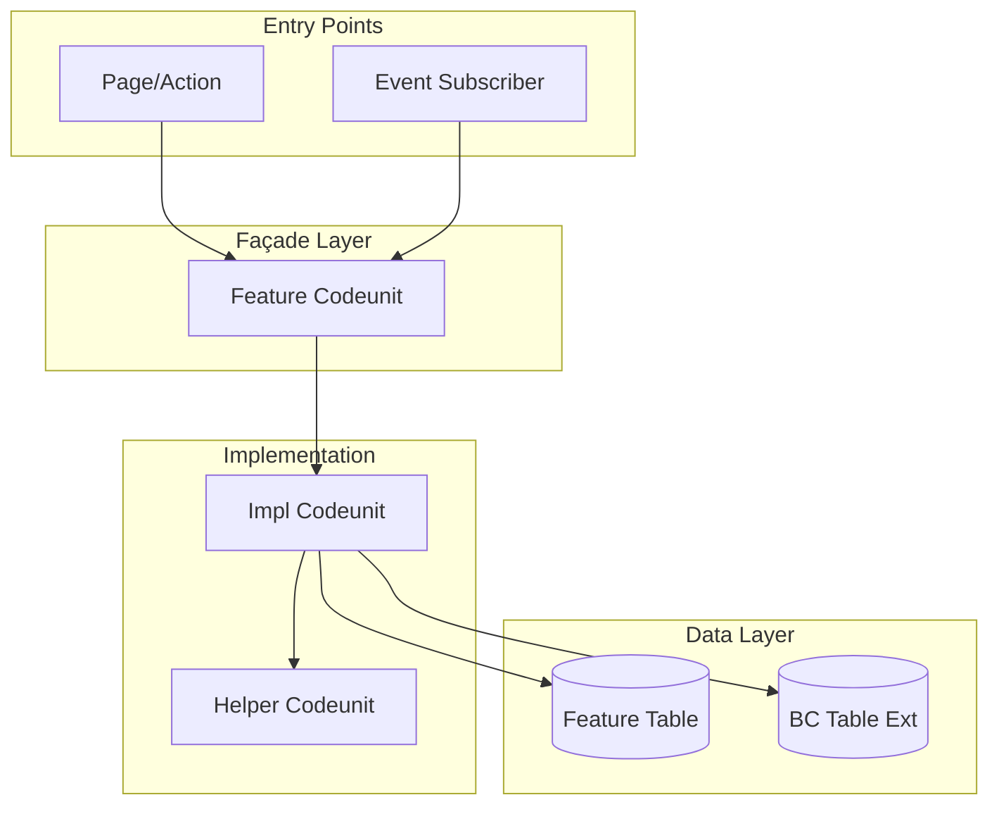
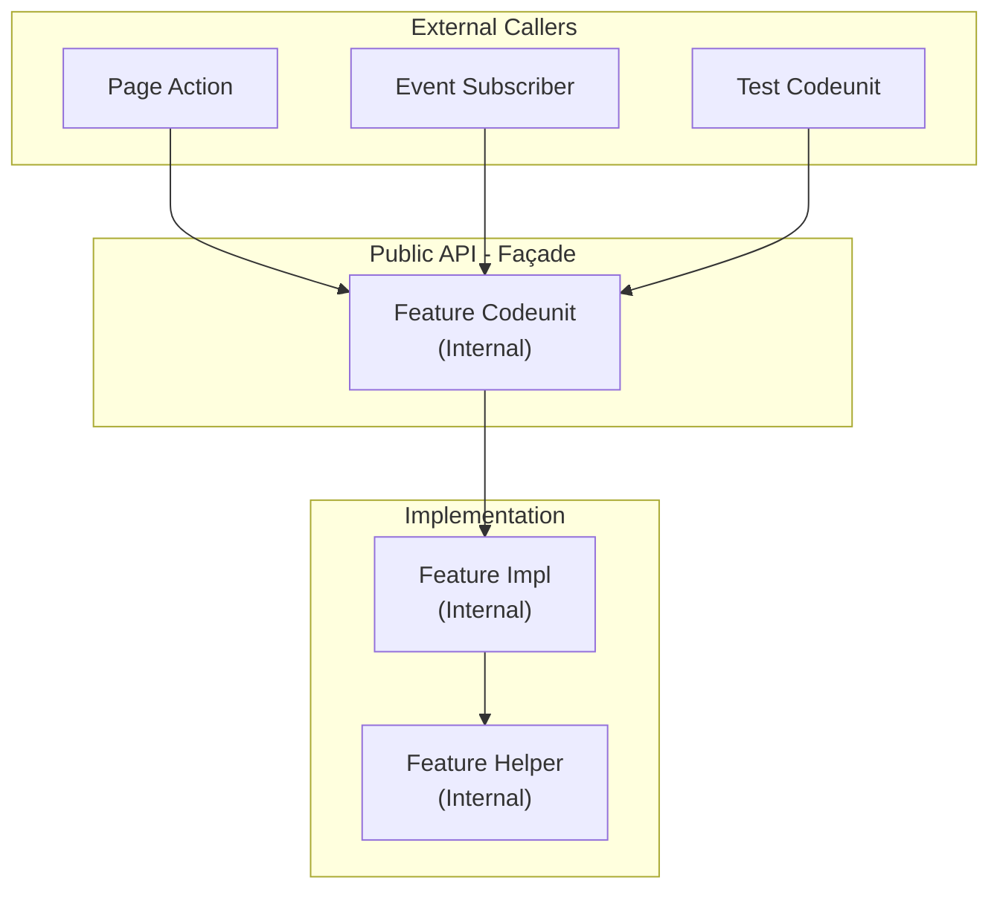
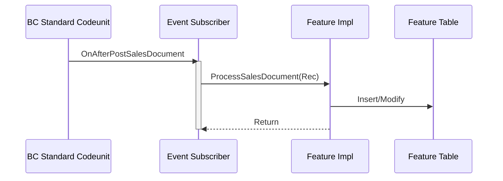
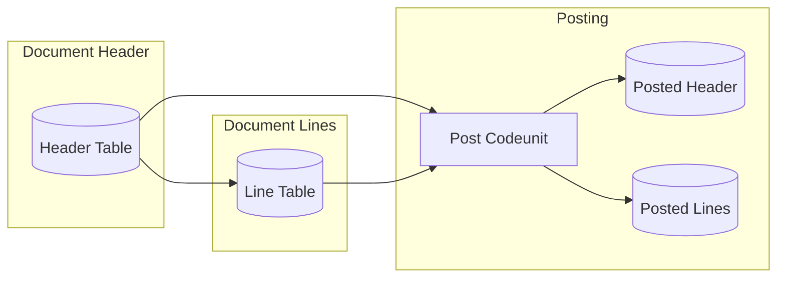
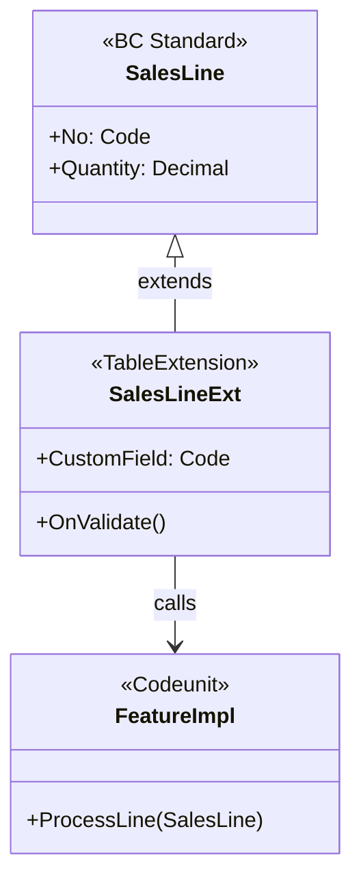

# Issue Body Template

This template shows how the issue body is structured after planning phases complete. The original issue description is preserved, and planning sections are appended.

---

## Template Structure

```markdown
[Original issue title and description preserved]

---

## Architecture

### AL Object Overview

| Object Type | Name | Responsibility | Key Interactions |
|-------------|------|----------------|------------------|
| Table | [Prefix] [Name] | [Data storage] | [Linked tables] |
| Codeunit | [Prefix] [Name] Impl | [Business logic] | [Events raised/consumed] |
| Codeunit | [Prefix] [Name] | [Façade] | [Entry points] |
| Page | [Prefix] [Name] Card/List | [UI exposure] | [Source table] |
| Extension | [Prefix] [BC Object] Ext | [Standard BC extension] | [Event subscriptions] |

### Pattern Applied

| Pattern | Where | Purpose |
|---------|-------|---------|
| Façade | Main codeunit | Single entry point, hides implementation |
| Generic Method | Impl codeunit | Reusable logic for multiple contexts |
| Event Bridge | TableExtension | Connects BC events to custom logic |
| Document | Table + Pages | Standard document structure |
| Discovery Event | Processing codeunit | Allows extensibility |

### Architecture Diagram



### Design Decisions

| Decision | Choice | Rationale |
|----------|--------|-----------|
| Access Modifiers | `Internal` for all | AppSource requirement, public API minimized |
| Event Design | Discovery events | Allow ISV extensibility |
| IsHandled Pattern | Yes/No | [Why or why not] |
| SetLoadFields | Required | Performance - partial record loading |
| Commit() | Avoided | Caller controls transaction boundary |
| Object IDs | [Range] | Follow repository ID allocation policy |

---

## Test Plan

### Feature: [Feature Name]

**Test Codeunit:** `[Prefix] [Feature] Test`
**Tags:** `[FEATURE] [Area] [Subarea]`

**Background:**
- Given [common setup via Initialize() and library codeunits]

### Scenario Inventory

| # | Scenario | Type | Risk | Procedure | TransactionModel | Handlers | Evidence |
|---|----------|------|------|-----------|------------------|----------|----------|
| 1 | [Happy path description] | Unit | Low | GivenX_WhenY_ThenZ | Default | — | LogTag: Happy |
| 2 | [Edge case description] | Unit | Med | GivenEdge_WhenAction_ThenResult | Default | — | LogTag: Edge |
| 3 | [UI interaction] | Integration | Med | GivenDoc_WhenConfirm_ThenResult | Default | ConfirmHandler | LogTag: UI |
| 4 | [Posting routine] | Integration | High | GivenDoc_WhenPost_ThenLedger | AutoCommit | MessageHandler | LogTag: Post |

### Rule to Scenario Traceability

| Rule # | Business Rule | Scenarios | Notes |
|--------|---------------|-----------|-------|
| R1 | [Rule from issue/analysis] | 1, 2 | Core behavior |
| R2 | [Another rule] | 3 | UI handling |
| R3 | [Posting rule] | 4 | Transaction boundary |

### Scenarios

#### Scenario 1: [Happy Path Name]

- **Rule(s)**: R1
- **Procedure**: `GivenValidSetup_WhenActionPerformed_ThenExpectedResult`
- **[FEATURE]**: [Area] [Subarea]
- **[SCENARIO]**: [Brief description of happy path]
- **[GIVEN]** [precondition setup via library codeunits]
- **[AND]** [additional setup if needed]
- **[WHEN]** [action performed]
- **[THEN]** [expected outcome verified with Assert]
- **[AND]** [additional verification if needed]
- **Evidence**: [Assert/log/trace target]

#### Scenario 2: [Edge Case Name]

- **Rule(s)**: R1, R2
- **Procedure**: `GivenEdgeCase_WhenAction_ThenExpectedBehavior`
- **[GIVEN]** [edge case setup]
- **[WHEN]** [action performed]
- **[THEN]** [expected outcome for edge case]
- **Evidence**: [Assert/log/trace target]

#### Scenario 3: [Error Case Name]

- **Rule(s)**: R2
- **Procedure**: `GivenInvalidInput_WhenAction_ThenErrorRaised`
- **[GIVEN]** [invalid/error setup]
- **[WHEN]** [action that should fail]
- **[THEN]** [expected error via asserterror or ExpectedError]
- **Evidence**: [Assert/log/trace target]
```

---

## Section Purposes

### Original Issue Description

- Preserved at the top
- Contains the original problem statement or feature request
- Written by issue creator

### Architecture

- Documents AL object design decisions made in Phase 3
- Pattern selection with rationale
- Mermaid diagrams showing object relationships
- Written in Phase 3

### Test Plan

- Complete specification of what will be tested
- BC-specific considerations (handlers, transaction model)
- Traceability from business rules to scenarios
- Evidence targets for verification
- Written in Phase 4

---

## Mermaid Diagram Examples

### Façade Pattern (Recommended for Codeunits)



### Event Bridge Pattern



### Document Workflow



### Table Extension Structure



---

## Tips

1. **Preserve original description** - Always keep the original issue text at the top
2. **Use horizontal rules** - Separate sections with `---` for clarity
3. **Keep sections in order** - Architecture before Test Plan
4. **Use exact table syntax** - Markdown tables must have consistent columns
5. **AL naming conventions** - Use `[Prefix] [Feature] [Suffix]` pattern for objects
6. **Access modifiers** - Default to `Internal` access for AppSource compliance
7. **Test procedure naming** - Use `GivenX_WhenY_ThenZ` pattern for clarity
