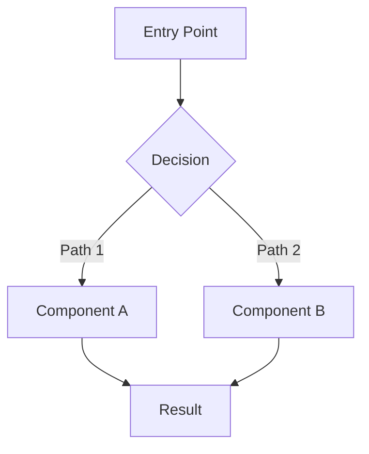
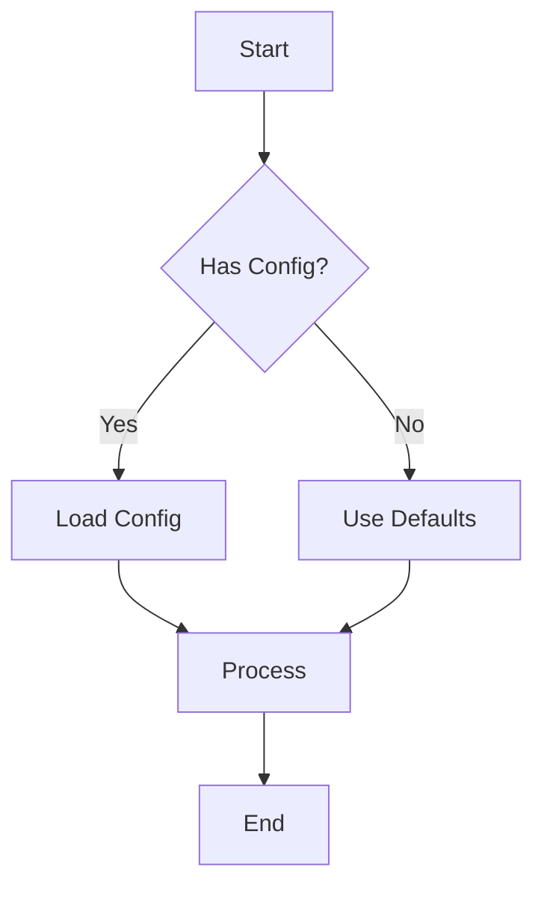
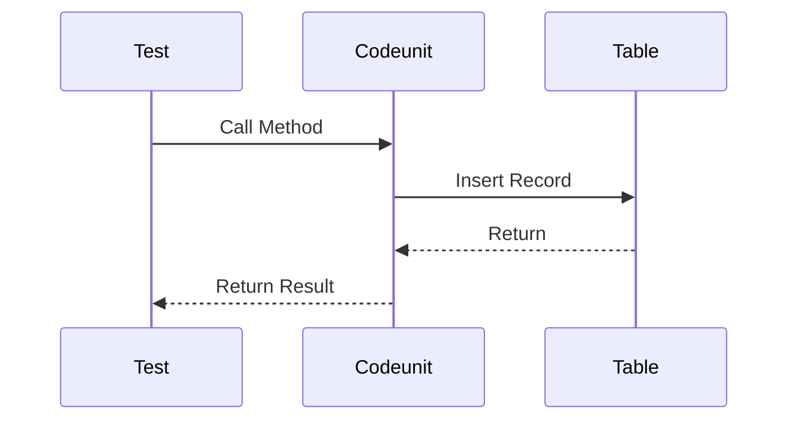
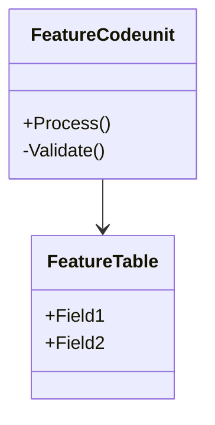

# PR Description Template

This template serves as the persistent state for the TDD implementation workflow. Each section is populated as phases complete.

---

## Template

```markdown
## Summary

Closes #{issue-number}

[Brief description of the feature being implemented]

---

## Architecture

### Component Overview

| Component | Responsibility | Files | Key Interactions |
|-----------|---------------|-------|------------------|
| [Component Name] | [What it does] | [file.al] | [Events/calls] |
| ... | ... | ... | ... |

### Architecture Diagram



### Design Decisions

- **[Decision 1]**: [Rationale]
- **[Decision 2]**: [Rationale]

---

## Test Plan

### Feature: [Feature Name]

**Background:**
- Given [common setup applied to all scenarios]

### Scenario Inventory

| # | Scenario | Type | Risk | Procedure | Telemetry Target |
|---|----------|------|------|-----------|------------------|
| 1 | [Happy path description] | Unit | Low | Test_HappyPath | DEBUG-BRANCH-HAPPY |
| 2 | [Edge case description] | Unit | Medium | Test_EdgeCase | DEBUG-BRANCH-EDGE |
| 3 | [Error case description] | Unit | High | Test_ErrorCase | DEBUG-BRANCH-ERROR |

### Rule to Scenario Traceability

| Rule # | Business Rule | Scenarios | Notes |
|--------|---------------|-----------|-------|
| 1 | [Rule from issue/analysis] | 1, 2 | Core behavior |
| 2 | [Another rule] | 3 | Error handling |

### Scenarios

#### Scenario 1: [Happy Path Name]

- **Rule(s)**: #1
- **Given** [precondition setup]
- **And** [additional setup if needed]
- **When** [action performed]
- **Then** [expected outcome]
- **And** [additional verification if needed]
- **Telemetry proof target**: `DEBUG-BRANCH-HAPPY`

#### Scenario 2: [Edge Case Name]

- **Rule(s)**: #1, #2
- **Given** [edge case setup]
- **When** [action performed]
- **Then** [expected outcome for edge case]
- **Telemetry proof target**: `DEBUG-BRANCH-EDGE`

#### Scenario 3: [Error Case Name]

- **Rule(s)**: #2
- **Given** [invalid/error setup]
- **When** [action that should fail]
- **Then** [expected error/behavior]
- **Telemetry proof target**: `DEBUG-BRANCH-ERROR`

---

## Implementation Progress

| # | Scenario | Red | Green | Refactor | Status |
|---|----------|-----|-------|----------|--------|
| 1 | Happy path | [ ] | [ ] | [ ] | Not started |
| 2 | Edge case | [ ] | [ ] | [ ] | Not started |
| 3 | Error case | [ ] | [ ] | [ ] | Not started |

### Progress Notes

_Updated as implementation proceeds_

---

## Review Checklist

- [ ] All scenarios passing
- [ ] Zero DEBUG-* telemetry in codebase
- [ ] Code review comments addressed
- [ ] Build gate passing
- [ ] Ready for merge
```

---

## Section Purposes

### Summary

- Links PR to issue with `Closes #N`
- Brief description for reviewers
- Written in Phase 1 (Setup)

### Architecture

- Copied from issue body
- Documents design decisions
- Component breakdown for understanding
- Mermaid diagrams for visualization

### Test Plan

- Copied from issue body
- Complete specification of what will be tested
- Traceability from business rules to scenarios
- Telemetry targets for verification

### Implementation Progress

- Real-time tracking of TDD cycle
- Enables resume from any point
- Updated throughout Phase 2

### Review Checklist

- Final verification before merge
- Completed in Phase 3

---

## Progress Table States

The Implementation Progress table uses checkboxes to track TDD phases:

### Checkbox Meanings

| Column | Checked Means |
|--------|---------------|
| Red | Test written and failing |
| Green | Implementation complete, test passing |
| Refactor | Code cleaned, DEBUG telemetry removed |

### Status Values

| Status | Meaning |
|--------|---------|
| Not started | No work begun |
| In progress | Currently being worked on |
| Complete | All three phases done |
| Blocked | Cannot proceed (document reason) |

### Example Progression

**Starting:**
```markdown
| 1 | Happy path | [ ] | [ ] | [ ] | Not started |
```

**After RED phase:**
```markdown
| 1 | Happy path | [x] | [ ] | [ ] | In progress |
```

**After GREEN phase:**
```markdown
| 1 | Happy path | [x] | [x] | [ ] | In progress |
```

**After REFACTOR phase:**
```markdown
| 1 | Happy path | [x] | [x] | [x] | Complete |
```

---

## Mermaid Diagram Examples

### Flowchart (Decision Logic)



### Sequence (Interactions)



### Class (Components)



---

## Tips

1. **Keep sections in order** - The resume logic depends on section presence
2. **Use exact checkbox syntax** - `[ ]` for unchecked, `[x]` for checked
3. **Update progress atomically** - Mark checkbox immediately after completing phase
4. **Document blockers** - If stuck, note it in the status column
5. **Link related PRs** - If work spawns additional PRs, reference them
